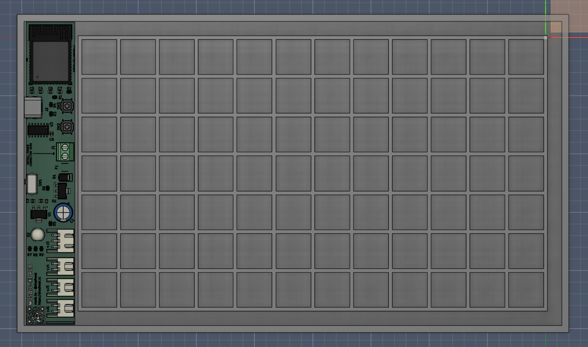
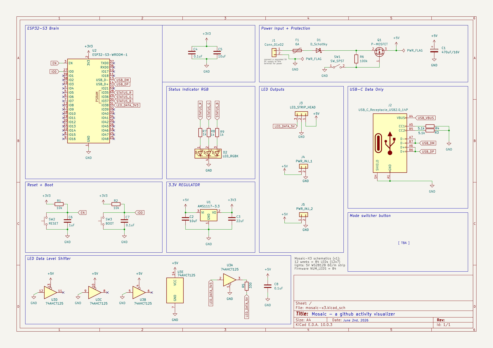
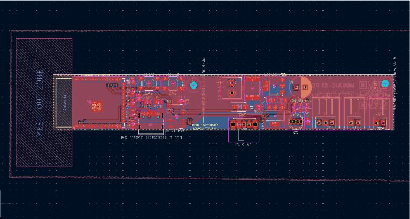
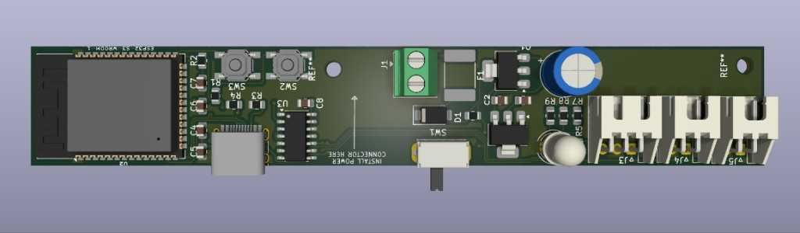
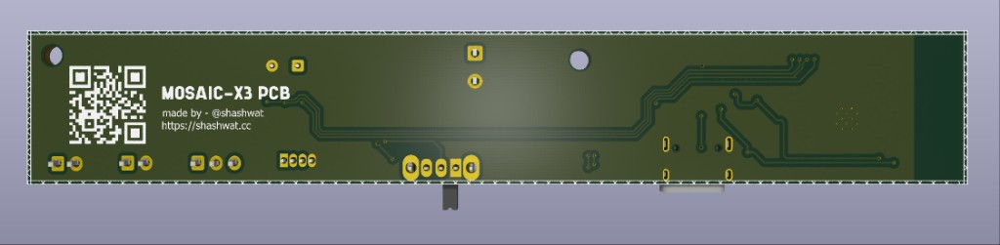

## Mosaic X3

Imagine if github contribution chart came to life as a frame which you could hang on your wall for decor. This is mosaic, you plug it in, connect your github account and tadaaa~ you now have a frame that mimicks your github contribution history graph.

features:

- 84 blocks to display the last 12 weeks worth of stats
- wifi, so it's easier to connect your github account
- a programmable nfc tag, so it's easier to access the admin page & change the github account
- it's a slim nice frame, designed so you can either hang this with a hanging rope, or using built in hooks behind the frame.
- a clean white design, looks really cool

### why

i wanted to make wall decor that felt personal and changed over time instead of being another static frame. my github contribution graph already represents the work i do, so turning it into a physical display felt like a fun mix of electronics, cad and code.

### how it was built

i designed the controller schematic and pcb in kicad around an esp32-s3. a 74ahct125 shifts the 3.3v data signal to 5v for the ws2812b leds. the 84 leds are arranged as a 12 x 7 grid inside a 3d printed enclosure, with an opal acrylic sheet in front to diffuse the light.

### schematic

### pcb

the bill of materials can be found [here](BOM.csv).
